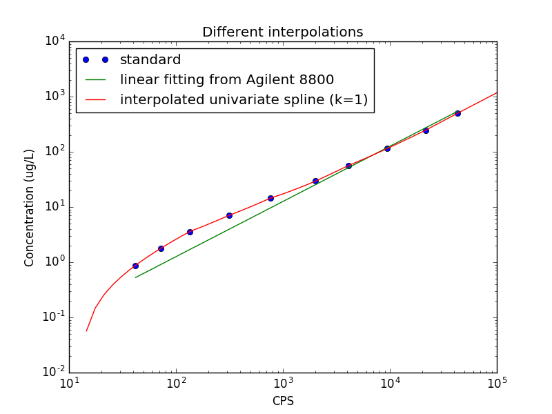

# ICP-MS Custom Interpolation
Add custom interpolation for Agilent 8800 Triple Quadrupole ICP-MS

## Getting Started

This script runs only on Python3 and processes data from Excel files (*.xlsx) with a specific format from Agilent 8800-QQQ ICP-MS. Plotting a comparison graph between the instrument linear fitting and custom 1-degree interpolated spline requires Numpy and Matplotlib. However, these two packages are completely optional.

### Prerequisites

The following Python3 packages are required:

```
Openpyxl
Numpy
Scipy
Matplotlib
```

These packages can be installed manually using
```
pip3 install ...
```
or please follow the full instruction below to install all the dependencies. 

### Installing

Clone the repository

```
$ git clone https://github.com/pbuabthong/icpms_process.git
$ cd icpms_process/
```

Install dependencies

```
$ pip3 install -r requirements.txt
```

## Usage

```
python3 interp_icpms.py [-v] [-p] [-k K] [-h] element std_filename raw_filename analyzed_filename
```

element: the abbreviation of the chemical element to be modified. eg. Te, P, Cd
std_filename: Excel filename containing the calibration concentration (normally 10 concentrations of 50% dilution each)
raw_filename: Excel filename with ICP-MS raw readout in CPS
analyzed_filename: Excel filename for the processed data from ICP-MS, but with linear interpolation

-v: increase the level of verbosity
-p: plot the fitting comparison at the end of the script
-k K: specify the degree of smoothing spline in the fitting (default K = 1)

For help, use -h or --help

```
python3 interp_icpms.py -h
```

## Examples

Modify ICP-MS result for tellurium (Te) concentration using 1D smoothing spline
```
python3 interp_icpms.py Te Examples/std.xlsx Examples/raw.xlsx Examples/alz.xlsx
```
The terminal would display
```
Loading standard file: Examples/std.xlsx
Loading raw file: Examples/std.xlsx
Loading analyzed file: Examples/std.xlsx
Converting...
Converted successfully. Saved as Examples/alz_mod.xlsx
```

The result is now saved as the same filename as the analyzed data with "_mod" at the end.

Additionally, an option -p can be added to display the comparison graph
```
python3 interp_icpms.py -p Te Examples/std.xlsx Examples/raw.xlsx Examples/alz.xlsx
```


## Authors

* **Pai Pakpoom Buabthong** - *Initial work* - [pbuabthong](https://github.com/pbuabthong)

## License

This project is licensed under the MIT License - see the [LICENSE.md](LICENSE.md) file for details
